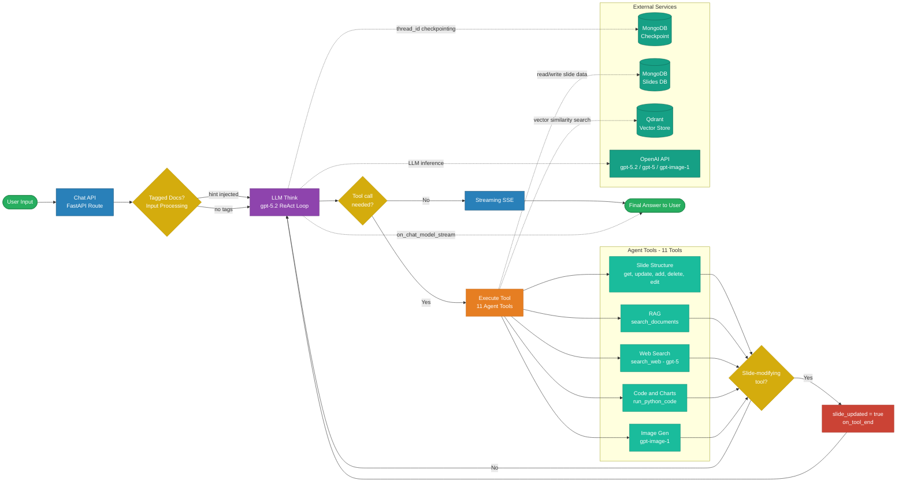

# Slide AI Agent 🐙
AI-powered presentation builder with a conversational agent, live Marp preview, source-document retrieval, and export to presentation formats.


---

## Agent Architecture
The agent uses a ReAct-inspired architecture with a single LLM for reasoning and tool use. The agent loop is triggered by user messages in the chat interface, and the agent can call tools for slide editing, RAG retrieval, web search, chart generation, and image generation. Agent actions are streamed back to the frontend for real-time UI updates.


```mermaid
%%{init: {"flowchart": {"htmlLabels": true, "nodeSpacing": 36, "rankSpacing": 54}}}%%
flowchart LR
    A(["User Input"]) --> B["Chat API<br/>FastAPI Route"]
    B --> C{"Tagged Docs?<br/>Input Processing"}
    C -->|hint injected| D
    C -->|no tags| D

    D["LLM Think<br/>gpt-5.2 ReAct Loop"] --> E{"Tool call<br/>needed?"}
    E -->|No| F["Streaming SSE"]
    F --> G(["Final Answer to User"])
    D -.->|on_chat_model_stream| G

    E -->|Yes| H["Execute Tool<br/>11 Agent Tools"]

    subgraph TOOLS[Agent Tools - 11 Tools]
        direction TB
        T1["Slide Structure<br/>get, update, add, delete, edit"]
        T2["RAG<br/>search_documents"]
        T3["Web Search<br/>search_web - gpt-5"]
        T4["Code and Charts<br/>run_python_code"]
        T5["Image Gen<br/>gpt-image-1"]
    end

    H --> T1
    H --> T2
    H --> T3
    H --> T4
    H --> T5
    T1 --> I{"Slide-modifying<br/>tool?"}
    T2 --> I
    T3 --> I
    T4 --> I
    T5 --> I
    I -->|No| D
    I -->|Yes| J["slide_updated = true<br/>on_tool_end"]
    J --> D

    subgraph INFRA[External Services]
        direction TB
        L[("MongoDB<br/>Checkpoint")]
        M[("MongoDB<br/>Slides DB")]
        N[("Qdrant<br/>Vector Store")]
        O["OpenAI API<br/>gpt-5.2 / gpt-5 / gpt-image-1"]
    end

    D -.->|thread_id checkpointing| L
    H -.->|read/write slide data| M
    H -.->|vector similarity search| N
    D -.->|LLM inference| O

    classDef userNode fill:#27ae60,stroke:#1e8449,color:#fff
    classDef llmNode fill:#8e44ad,stroke:#6c3483,color:#fff
    classDef toolNode fill:#e67e22,stroke:#ca6f1e,color:#fff
    classDef apiNode fill:#2980b9,stroke:#1a5276,color:#fff
    classDef infraNode fill:#16a085,stroke:#0e6655,color:#fff
    classDef decisionNode fill:#d4ac0d,stroke:#b7950b,color:#fff
    classDef flagNode fill:#cb4335,stroke:#a93226,color:#fff
    classDef toolGroupNode fill:#1abc9c,stroke:#148f77,color:#fff

    class A,G userNode
    class D llmNode
    class H toolNode
    class B,F apiNode
    class L,M,N,O infraNode
    class C,E,I decisionNode
    class J flagNode
    class T1,T2,T3,T4,T5 toolGroupNode
```

---

## Feature Checklist

- [x] **AI slide generation and editing** - Create, rewrite, add, delete, and edit slides through the chat agent.
- [x] **Manual Marp markdown editor** - Edit the outline directly with Markdown helpers and slide separator insertion.
- [x] **Live Marp preview** - Render saved markdown as slides, navigate slides, and keep the preview synced after saves.
- [x] **Auto-save and manual save** - Save editor changes automatically or with `Ctrl+Shift+S`.
- [x] **RAG sources** - Upload PDF, DOCX, TXT, or Markdown files for grounded slide content.
- [x] **Source selection and `@filename` tagging** - Scope chat answers to selected or explicitly tagged documents.
- [x] **Web search tool** - Search current public information and surface source links in streamed chat output.
- [x] **Chart generation** - Run sandboxed Python/matplotlib code and save chart PNGs under `/uploads/charts`.
- [x] **AI image generation and editing** - Generate or edit slide assets and save them under `/uploads/images`.
- [x] **Add generated assets to slides** - Preview images from chat and insert them into a selected slide.
- [x] **Export** - Download slides as HTML, PDF, PPTX, editable PPTX, or Markdown.
- [x] **Workspace controls** - Resize panels, collapse the left panel, rename sessions, and navigate by active slide.
- [x] **Session memory and history** - Persist slide sessions and chat transcripts with MongoDB, with recent/searchable sessions and cleanup for old sessions.
- [x] **Static asset serving** - Serve generated charts and images through `/uploads` for preview and export.

---

## Todo

- [ ] Show streaming reasoning summary and execution plan while generating slides
- [ ] Add guardrails for safety, policy, and content validation before applying agent actions
- [ ] Integrate tracing tools such as Langfuse for prompt, tool, and cost observability
- [ ] Add multi-agent orchestration for research, writing, review, and editing
- [ ] Let users switch between model types and configure their OpenAI API key in the UI
- [ ] Estimate token usage and generation cost before or during slide creation

## Installation

Prerequisites:

- Docker and Docker Compose v2
- OpenAI API key

```bash
git clone <repo-url>
cd slide-ai-agent

cp be/.env.example be/.env
# Set OPENAI_API_KEY in be/.env

docker compose up --build -d
```

Open the app:

- App: http://localhost:8999
- API docs: http://localhost:8000/docs

Session management:

- Open the history drawer from the left-panel history button.
- Search by session title or chat transcript content.
- Use the trash button on a session to delete its slides, chat history, uploaded source metadata, agent memory, and indexed vectors.

Stop services:

```bash
docker compose down
```

Remove local data:

```bash
docker compose down -v
```

---

## Project Structure

```text
slide-ai-agent/
├── be/                  # FastAPI backend, agent, RAG, slide export
│   ├── src/
│   ├── assets/
│   └── Dockerfile
├── fe/                  # React + Vite frontend
│   ├── src/
│   └── Dockerfile
├── docker-compose.yml
└── README.md
```

## License

MIT
